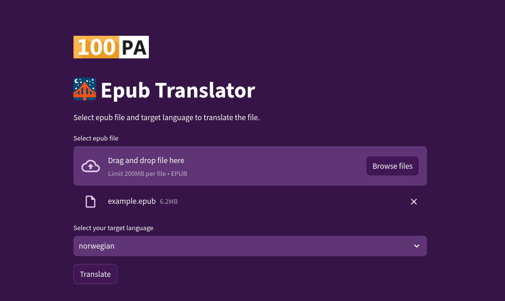

# EPUB Translator with Streamlit Interface

## A translator for EPUB files with a Streamlit interface that skips translating programming code and preserves the original code in programming languages.

### Program Description

This program is based on the epub-translator library by quantrancse (https://github.com/quantrancse/epub-translator). It has been extended with a Streamlit interface that makes it easy to use.

### Features

    Translate EPUB files to a selected language
    Skip translating programming code
    Preserve the original code in programming languages



Installation Instructions

Install Python 3.10 or later
Install venv:
```	python -m venv venv     ```
Activate virtual environment:
``` source venv/bin/activate    ```
Clone this repository using the command:
``` git clone https://github.com/your-nickname/epub-translator-streamlit.git    ```
Install the required libraries using the command:
``` pip install -r requirements.txt    ```

Go to the program directory and run it using the command:

```
streamlit run main.py
```

### Using the Program

    Run the program using the command streamlit run app.py
    Select the EPUB file you want to translate
    Select the target language
    Click the "Translate" button

### License

This program is licensed under the MIT License.

### Acknowledgments

    quantrancse for the epub-translator library (https://github.com/quantrancse/epub-translator)
